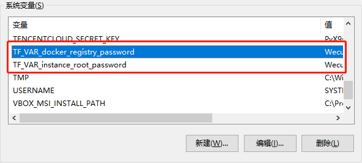

中文 / [English](README_EN.md)

# 公有云软件系统一键交付 (Delivery By Terraform)
使用Terraform一键交付公有云软件系统

## 使用方法:
### 1. 下载 Terraform
官方下载地址:
[https://www.terraform.io/downloads.html](https://www.terraform.io/downloads.html)
>根据操作系统类型下载
e.g.  
Windows 64: [https://releases.hashicorp.com/terraform/0.12.19/terraform_0.12.19_windows_amd64.zip](https://releases.hashicorp.com/terraform/0.12.19/terraform_0.12.19_windows_amd64.zip)  
Linux 64: [https://releases.hashicorp.com/terraform/0.12.19/terraform_0.12.19_linux_amd64.zip](https://releases.hashicorp.com/terraform/0.12.19/terraform_0.12.19_linux_amd64.zip)

### 2. 配置 Terraform (以Windows为例)
#### 2.1 下载后解压至任一目录（如d:\terraform)
 
#### 2.2 配置Path，可在任何目录执行terraform


### 3. 下载本仓库
```
$cd d:\dev
$git clone https://github.com/jordanzhangsz/delivery-by-terraform.git
```

### 4. 运行Terraform部署应用
部署之前先配WeCube打包的镜像仓库密码至环境变量，以及设置mysql的root密码
 

#### 4.1 部署阿里云
##### 4.1.1 配置Access Key/Secret Key至本地环境变量 

>注意: Access Key/Secret Key是敏感信息，建议配置到本地环境变量，不要配置在Terraform的模板文件*.tf里
##### 4.1.2 初始化Terraform
```
$cd d:\dev\delivery-by-terraform\delivery-wecube\to_ali_cloud
$terraform init    -- 安装阿里云的插件, 需要点时间，因国内网速较慢
```
##### 4.1.3 执行部署(一键部署)
```
$cd d:\dev\delivery-by-terraform\delivery-wecube\to_ali_cloud
$terraform apply   -- 执行部署
$.....
$Enter a value: yes  -- 确认执行
$.....
```

>如果你看到这个，说明已部署成功，拷贝输出的URL至浏览器即可访问Wecube


##### 4.1.4 销毁部署 (一键销毁)
```
$cd d:\dev\delivery-by-terraform\delivery-wecube\to_ali_cloud
$terraform destroy   -- 销毁部署
$.....
$Enter a value: yes  -- 确认执行
$.....
```


#### 4.2 部署腾讯云
##### 4.2.1 配置Access Key/Secret Key至本地环境变量 

>注意: Access Key/Secret Key是敏感信息，建议配置到本地环境变量，不要配置在Terraform的模板文件*.tf里

##### 4.1.2 初始化Terraform
```
$cd d:\dev\delivery-by-terraform\delivery-wecube\to_tencent_cloud
$terraform init    -- 安装腾讯云的插件, 需要点时间，因国内网速较慢
```

##### 剩余的步骤跟上面的阿里云部署的步骤4.1.3， 4.1.4类似。
