中文 / [English](README_EN.md)

# 公有云软件系统一键交付 (Delivery By Terraform)
使用Terraform一键交付公有云软件系统

## 使用方法:
### 1. 下载 Terraform
官方下载地址:
[https://www.terraform.io/downloads.html](https://www.terraform.io/downloads.html)
>根据操作系统类型下载
e.g.  
Windows 64: [https://releases.hashicorp.com/terraform/0.12.19/terraform_0.12.19_windows_amd64.zip](https://releases.hashicorp.com/terraform/0.12.19/terraform_0.12.19_windows_amd64.zip)  
Linux 64: [https://releases.hashicorp.com/terraform/0.12.19/terraform_0.12.19_linux_amd64.zip](https://releases.hashicorp.com/terraform/0.12.19/terraform_0.12.19_linux_amd64.zip)

### 2. 配置 Terraform (以Windows为例)
#### 2.1 下载后解压至任一目录（如d:\terraform)
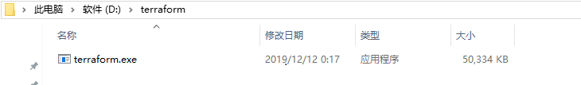 
#### 2.2 配置Path，可在任何目录执行terraform
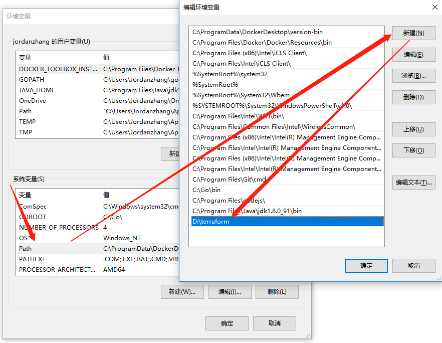

### 3. 下载本仓库
```
$cd d:\dev
$git clone https://github.com/WeBankPartners/delivery-by-terraform.git
```

### 4. 运行Terraform部署WeCube
为方便用户体验，我们提供了单机版和生产基础版两种部署方案。

[单机版](#5-单机版)  
[生产版](#6-生产版)

### 5. 单机版
单机版目前提供了阿里云和腾讯云两个云服务商的版本。
顾名思义，单机版只需要一台云服务器即可部署WeCube。

部署之前，可以修改下面terraform变量值，否则会使用默认值；

变量名 | 默认值 |  描述  
-|-|-
instance_root_password | WeCube1qazXSW@ | 云主机的root密码 |
mysql_root_password | WeCube1qazXSW@ | mysql数据库的root密码 |
wecube_version | v2.1.1 | wecube的版本 |

也可以通过修改环境变量的方式来设置terraform变量
WeCube主机的密码至环境变量（不改默认为WeCube1qazXSW@）：  
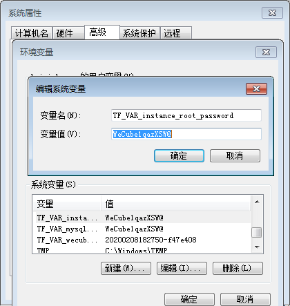 

配置mysql的root密码（不改默认为WeCube1qazXSW@）：  
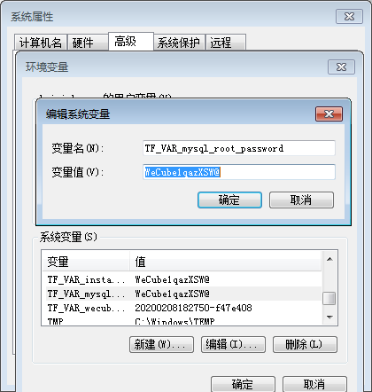 

配置wecube的version，即镜像tag（不改默认为v2.1.1）：  
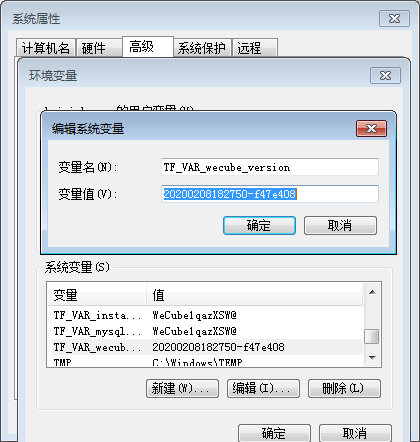 

#### 5.1 部署阿里云
##### 5.1.1 配置Access Key/Secret Key至本地环境变量（默认使用region为cn-hangzhou） 
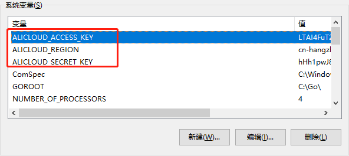
>注意: Access Key/Secret Key是敏感信息，建议配置到本地环境变量，不要配置在Terraform的模板文件*.tf里

>注意: 若配置的region不为"cn-hangzhou"，则需要相应的修改delivery-by-terraform\delivery-wecube-for-stand-alone\to_ali_cloud\aliyun_wecube.standalone.tf中出现的所有"availability_zone"的值。例如region配置为"cn-shenzhen",availability_zone则需要修改为"cn-shenzhen-a"或者深圳地域下的其他可用区。

##### 5.1.2 初始化Terraform
```
$cd d:\dev\delivery-by-terraform\delivery-wecube-for-stand-alone\to_ali_cloud
$terraform init    -- 安装阿里云的插件, 需要点时间，因国内网速较慢
```
##### 5.1.3 执行部署(一键部署)
```
$cd d:\dev\delivery-by-terraform\delivery-wecube-for-stand-alone\to_ali_cloud
$terraform apply   -- 执行部署
$.....
$Enter a value: yes  -- 确认执行
$.....
```
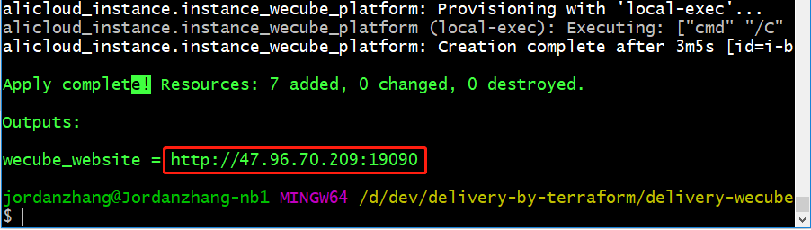
>如果你看到这个，说明已部署成功，拷贝输出的URL至浏览器即可访问Wecube
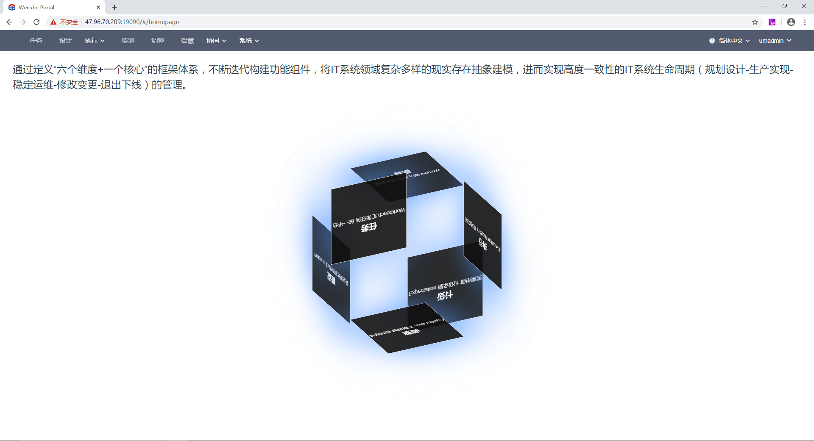


#### 5.1.4 销毁部署 (一键销毁)
```
$cd d:\dev\delivery-by-terraform\delivery-wecube-for-stand-alone\to_ali_cloud
$terraform destroy   -- 销毁部署
$.....
$Enter a value: yes  -- 确认执行
$.....
```

**若有destroy过程中报错，可执行terraform refresh 更新资源状态，再执行terraform destroy**  

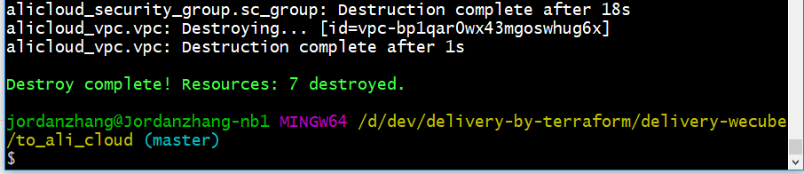

#### 5.2 部署腾讯云
##### 5.2.1 配置Access Key/Secret Key至本地环境变量 
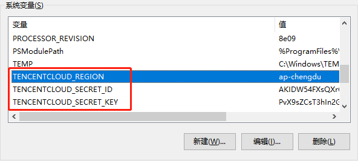
>注意: Access Key/Secret Key是敏感信息，建议配置到本地环境变量，不要配置在Terraform的模板文件*.tf里  
>注意: 若配置的region不为"ap-guangzhou"，则需要相应的修改delivery-by-terraform\delivery-wecube-for-stand-alone\to_tencent_cloud\tencent_wecube.tf中出现的所有"availability_zone"的值。例如region配置为"ap-chengdu",availability_zone则需要修改为"ap-chengdu-1"或成都地域下的其他可用区。

##### 5.2.2 初始化Terraform
```
$cd d:\dev\delivery-by-terraform\delivery-wecube-for-stand-alone\to_tencent_cloud
$terraform init    -- 安装腾讯云的插件, 需要点时间，因国内网速较慢
```

##### 剩余的步骤跟上面的阿里云部署的步骤5.1.3， 5.1.4类似。


### 6. 生产版
生产版是使用云服务提供的持久化存储，可满足生产环境的基础需求。
目前提供了[腾讯云](#61-腾讯云-生产环境基础版)和[华为云](#62-华为云-生产环境基础版)的版本。  

#### 6.1 腾讯云-生产环境基础版
**适用于腾讯云中国站**  
此版本规划如下：   
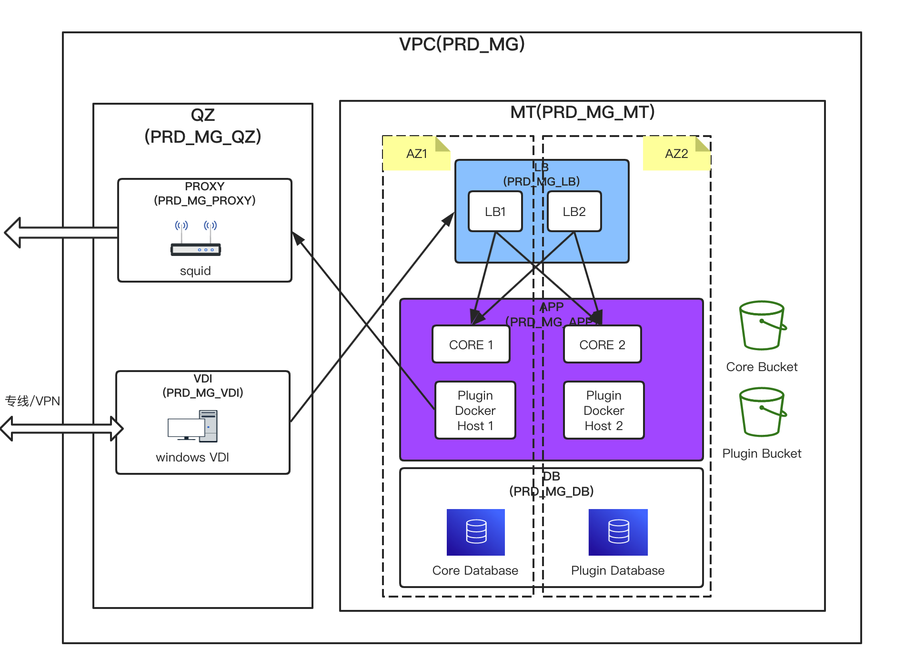  
此版本部署将会创建：  

1.私有网络  
云资源 |  数量 |  名称 | 描述       
-|-|-|-
tencentcloud_vpc | 1 | PRD_MG | 网段10.128.192.0.19 
tencentcloud_subnet | 8 |PRD1_MG_VDI <br> PRD1_MG_PROXY <br> PRD1_MG_LB <br> PRD2_MG_LB <br> PRD1_MG_APP <br> PRD2_MG_APP <br> PRD1_MG_RDB <br> PRD2_MG_RDB |10.128.192.0/24 <br> 10.128.199.0/24 <br> 10.128.200.0/24 <br> 10.128.216.0/24 <br> 10.128.202.0/24 <br> 10.128.218.0/24 <br> 10.128.206.0/24 <br> 10.128.222.0/24 

2.安全组  
云资源 |  数量 |  名称       
-|-|-
tencentcloud_security_group | 1 | PRD_MG 

安全组规则  
入站/出站 |  规则协议 | 端口 |  来源  |  策略  |  描述    
-|-|-|-|-|-
入站|TCP|20000-30000|10.128.218.0/24|允许|-
入站|TCP|20000-30000|10.128.202.0/24|允许|-
入站|TCP|3389|218.17.197.195|允许|-
入站|TCP|22|218.17.197.195|允许|-
入站|TCP|80|10.128.192.0/19|允许|-
入站|TCP|443|10.128.192.0/19|允许|-
入站|TCP|3306|10.128.192.0/19|允许|-
入站|TCP|3307|10.128.192.0/19|允许|-
入站|TCP|9000|10.128.192.0/19|允许|-
入站|TCP|9001|10.128.192.0/19|允许|-
入站|TCP|22|10.128.192.0/19|允许|-
入站|TCP|3128|10.128.192.0/19|允许|-
入站|TCP|19090|10.128.192.0/19|允许|-
入站|TCP|19110|10.128.192.0/19|允许|-
入站|TCP|2375|10.128.192.0/19|允许|-
入站|TCP|19120|10.128.192.0/19|允许|-
入站|TCP|19100|10.128.192.0/19|允许|-
入站|TCP|19101|10.128.192.0/19|允许|-
入站|TCP|1-65535|10.128.0.0/17|允许|-
出站|TCP|1-65535|0.0.0.0/0|允许|-  
  
3.云数据库MySQL：  
云资源 |  实例名 | 默认规格 |  所属子网 |   用途      
-|-|-|-|-  
tencentcloud_mysql_instance|PRD1_MG_RDB_wecubecore | 1核2000M，40G | subnet_db  |  WeCube数据库 
tencentcloud_mysql_instance|PRD1_MG_RDB_wecubeplugin | 2核2000M，50G | subnet_db  |  插件数据库   

4.对象存储COS     
云资源 |  数量 |  名称 | 描述       
-|-|-|-  
tencentcloud_cos_bucket | 1 | wecube-bucket-[APPID] | APPID请在腾讯云上查看 

5.主机部署规划如下：    
云主机内网IP | 默认规格 |  所属子网 |   部署组件      
-|-|-|-
10.128.202.3 | 4C8G | PRD1_MG_APP  |   运行插件的容器母机+插件S3存储
10.128.218.3 | 4C8G | PRD1_MG_APP  |   运行插件的容器母机
10.128.202.2 | 2C4G | PRD1_MG_APP  |   运行WeCube  
10.128.218.2 | 2C4G | PRD1_MG_APP  |   运行WeCube  
10.128.199.3 | 1C1G |  PRD1_MG_PROXY |  运行Squid  |  
10.128.192.3 | 2C4G | PRD1_MG_VDI  | 运行Windows VDI主机 |  
  
6.变量配置   
部署之前，可以修改terraform.tfvars文件中变量值，否则会使用默认值；   

变量名 | 默认值 |  描述   
-|-|-  
secret_id | 空 | 必输，腾讯云账号生成secret_id
secret_key | 空 | 必输，腾讯云账号生成secret_key
region | ap-hongkong | 部署资源的地域
default_password | Wecube@123456 | 部署资源的默认密码，包括linux上root用户的密码，windows上Administrator用户的密码，mysql上的root用户密码 |
wecube_version | v2.1.1 | wecube的版本 |
availability_zone_1 | ap-guangzhou-3 | 部署的主可用区 |
availability_zone_2 | ap-guangzhou-4 | 部署的副可用区 |
cos_name | wecube-bucket-1234567890 | '1234567890' 必须替换成自己的[APPID](url:https://console.cloud.tencent.com/capi) |  
  
##### 6.1.1 配置参数  
打开delivery-by-terraform\delivery-wecube-for-stand-alone\to_tencent_cloud\terraform.tfvars，
配置参数

##### 6.1.2 初始化Terraform
```
$terraform init   -- 执行初始化，期间会下载terraform provider，国内网络比较慢
```
 
###### 6.1.3 行部署(一键部署)
```
$cd d:\dev\delivery-by-terraform\delivery-wecube-for-production\to_tencent_cloud
$terraform apply   -- 执行部署
$.....
$Enter a value: yes  -- 确认执行
$.....
```
  
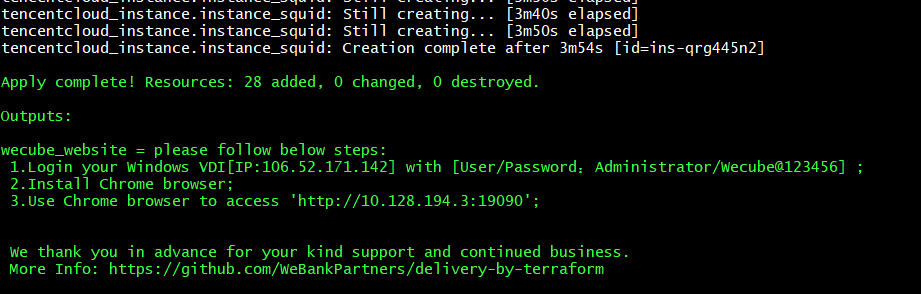  
>根据上图步骤，如果你看到这个，说明已部署成功  
  
##### 6.1.4 销毁部署 (一键销毁)  
参考5.1.4 销毁部署。  
   
    
#### 6.2 华为云-生产环境基础版
**适用于华为云国际站**  
此版本应用部署图如下：  

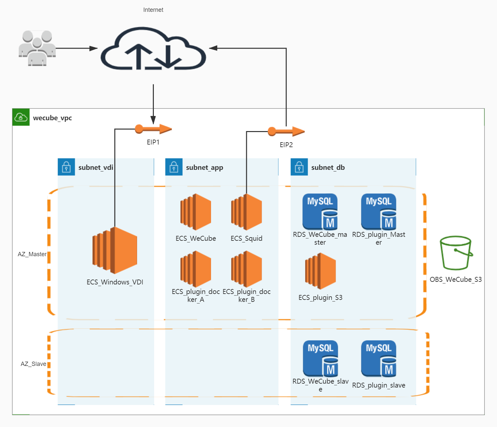

1.所有资源都部署在一个vpc [10.128.192.0/19]  
  
2.在vpc中划分三个子网  
    - 10.128.195.0/24 subnet_vdi
    - 10.128.194.0/25 subnet_app
    - 10.128.194.128/26 subnet_db
  
3.每个子网建立一个安全组  
  
sg_group_wecube_vdi  
入站/出站 |  规则协议 | 端口 |  来源  |  策略    
-|-|-|-|-
入站|TCP|1-65535|10.128.192.0/19|允许  
入站|TCP|3389|0.0.0.0/0|允许
出站|TCP|1-65535|0.0.0.0/0|允许  
  
sg_group_wecube_db  
入站/出站 |  规则协议 | 端口 |  来源  |  策略     
-|-|-|-|-  
入站|TCP|1-65535|10.128.192.0/19|允许  
入站|TCP|3306-3307|0.0.0.0/0|允许   
入站|TCP|9001|0.0.0.0/0|允许  
入站|TCP|22|0.0.0.0/0|允许  
出站|TCP|1-65535|0.0.0.0/0|允许  
   
sg_group_wecube_app  
入站/出站 |  规则协议 | 端口 |  来源  |  策略    
-|-|-|-|-  
入站|TCP|1-65535|10.128.192.0/19|允许  
入站|TCP|2375|0.0.0.0/0|允许
入站|TCP|22|0.0.0.0/0|允许
入站|TCP|19090|0.0.0.0/0|允许
入站|TCP|3128|10.128.192.0/19|允许
出站|TCP|1-65535|0.0.0.0/0|允许
 
4.RDS云数据库MySQL：  

实例名 | 默认规格 | 存储空间 |  所属子网 |  绑定安全组 |  部署组件      
-|-|-|-|-|-
WecubeDbInstance | rds.mysql.c2.large.ha（2核4GB）  | 40GB | subnet_db  |  sg_group_wecube_db |  WeCube数据库  |
PluginDbInstance | rds.mysql.c2.large.ha（2核4GB） | 40GB | subnet_db  |  sg_group_wecube_db |  插件数据库  |

5.对象存储OBS
申请OBS存储桶（默认名字为s3-wecube）作为WeCube的S3存储。

6.主机部署规划如下：  

云主机内网IP | 默认规格 |  所属子网 |  绑定安全组 |  部署组件      
-|-|-|-|-  
10.128.194.130 | 4C8G | subnet_db  |  sg_group_wecube_db |  插件资源（S3对象存储）  |  
10.128.194.4 | 4C8G | subnet_app  |  sg_group_wecube_app |  插件容器母机A  |  
10.128.194.5 | 4C8G | subnet_app  |  sg_group_wecube_app |  插件容器母机B  |  
10.128.194.3 | 4C8G | subnet_app  |  sg_group_wecube_app |  WeCube（含platform-core、platform-gateway、wecube-portal、auth-server）  |  
10.128.194.2 | 4C8G | subnet_app  |  sg_group_wecube_app |  Squid  |  
10.128.195.2 | 4C8G | subnet_vdi  |  sg_group_wecube_vdi |  Windows VDI主机 |    
    
7.变量配置：   
**部署之前，可以修改下面terraform变量值，否则会使用默认值**   
变量名 | 默认值 |  描述  
-|-|-
hw_access_key | hw_access_key | **必须修改为自己的AK** |
hw_secret_key | hw_secret_key | **必须修改为自己的SK** |
hw_region | hw_secret_key | 指定部署WeCube的region |
hw_tenant_name | hw_secret_key | 账户内的租户名，一般和region一致 |
hw_dns1 | hw_secret_key | 首选DNS，根据指定的region选择华为云提供的[内网DNS地址](https://support.huaweicloud.com/dns_faq/dns_faq_002.html) |
hw_dns2 | hw_secret_key | 备选DNS，根据指定的region选择华为云提供的[内网DNS地址](https://support.huaweicloud.com/dns_faq/dns_faq_002.html) |
hw_az_master | hw_secret_key | 首选Available Zone |
hw_az_slave | hw_secret_key | 备选Available Zone |
default_password | Wecube@123456 | 部署资源的默认密码，包括linux上root用户的密码，windows上Administrator用户的密码，mysql上的root用户密码 |
wecube_version | v2.2.0 | wecube的版本 |(url:https://console.cloud.tencent.com/capi) |

##### 6.2.1 使用步骤

##### 6.2.1.1 以命令行方式进入到华为云生产基础版的主目录
进入华为云生产基础版目录
```
$cd d:\dev\delivery-by-terraform\delivery-wecube-for-production\to_huawei_cloud
```  

##### 6.2.1.2 配置Access Key/Secret Key
配置方式有两种：
 * 编辑vars.tf中的hw_access_key和hw_secret_key的default值；
 * 在步骤6.2.1.3在执行terraform apply命令的时候以参数形式传入，命令如下：
 ```
 terraform apply -var 'hw_access_key=your_ak' -var 'hw_secret_key=your_sk'
```
**注意：若以此种方式，则销毁时也需要传入AK/SK**

##### 6.2.1.2 初始化Terraform
 ```
 terraform init
```
 
##### 6.2.1.3 执行部署(一键部署)
```
$terraform apply   -- 执行部署
$.....
$Enter a value: yes  -- 确认执行
$.....
```
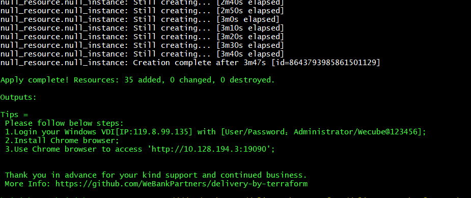

##### 6.2.1.4 使用WeCube
 * 根据步骤6.2.1.3 输出的步骤，需要先登录windows VDI，登录方式请参考[华为云Windows弹性云服务器登录方式](https://support.huaweicloud.com/usermanual-ecs/zh-cn_topic_0092494943.html?utm_source=ecs_Growth_map&utm_medium=display&utm_campaign=help_center&utm_content=Growth_map)
 * 然后在Windows VDI安装Chrome浏览器（目前WeCube已完整适配Chrome,为了您的使用方便，请勿使用其他未适配的浏览器）
 * 使用Chrom浏览器打开 *http://10.128.194.3:19090* ，如果你看到以下页面，说明你的WeCube已经部署成功了


 **附：官方插件包[下载地址](https://github.com/WeBankPartners/wecube-platform/releases)**


##### 6.2.1.5 销毁部署 (一键销毁)
```
$terraform destroy   -- 执行部署
$.....
$Enter a value: yes  -- 确认执行
$.....
```

